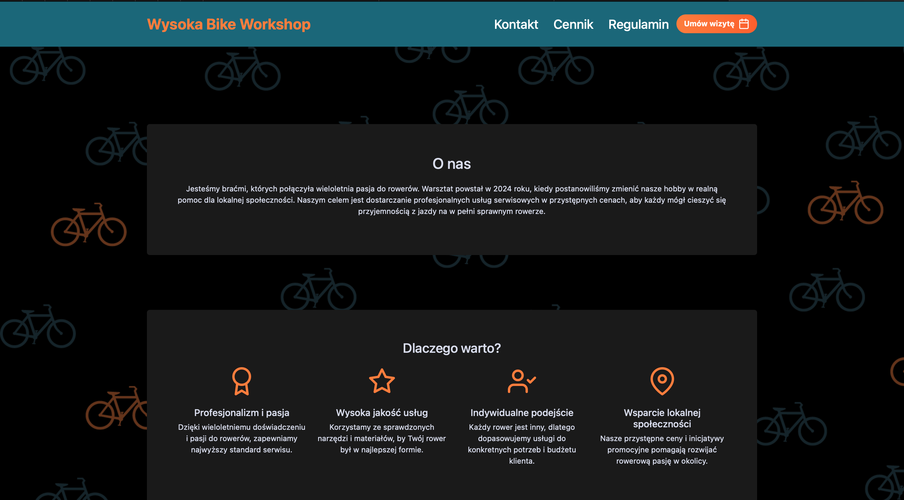
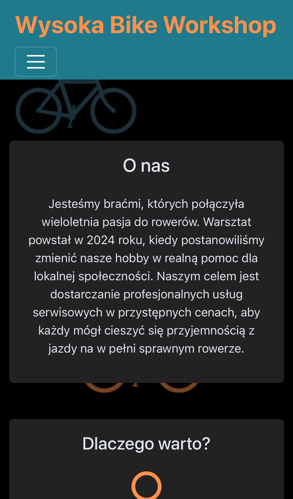

# 🚲 WBW – Strona serwisu rowerowego

Responsywna strona internetowa dla fikcyjnego serwisu rowerowego.  
Wykonana w **HTML, CSS, JavaScript i Bootstrap 5**, przystosowana do działania na urządzeniach mobilnych i komputerach.

## 🌐 Demo

👉 [Zobacz stronę na GitHub Pages](https://dominat3.github.io/WBW/)

## 📸 Zrzuty ekranu




## 🛠️ Technologie

- HTML5
- CSS3
- JavaScript
- Bootstrap 5

## 🚀 Funkcje

- Strona w pełni **responsywna** (RWD)
- Formularz rezerwacji wizyty
- Cennik usług
- Sekcja kontaktowa
- Przystosowana do urządzeń mobilnych i desktopowych

## ⚙️ Instalacja i uruchomienie

1. Sklonuj repozytorium:
   ```bash
   git clone https://github.com/dominat3/WBW.git
   ```
